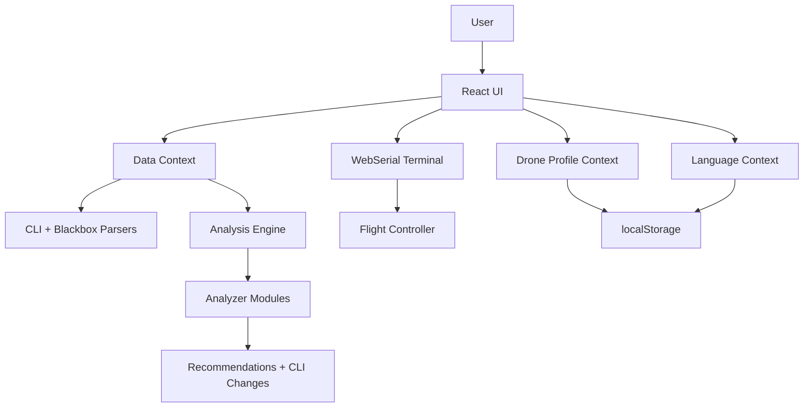
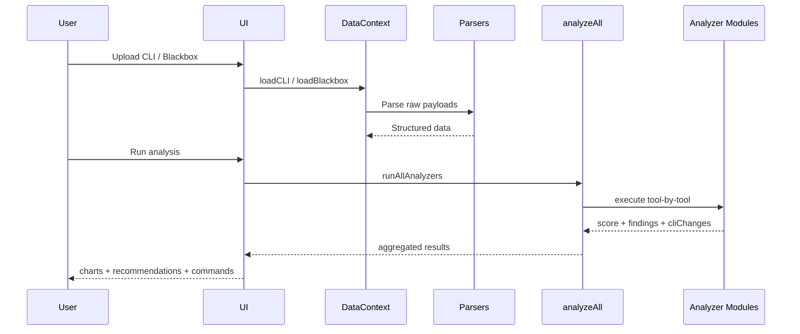

# Betaflight Tuning Assist - Master Context

## 1. Product Identity

Betaflight Tuning Assist is a local-first FPV tuning application for Betaflight users.
The app runs in:
- Web mode (Vite + React)
- Desktop mode (Electron wrapper)

Primary purpose:
- Parse blackbox logs and CLI dumps
- Run signal-based analysis
- Convert findings into actionable CLI tuning commands

## 2. Target User

Primary users are:
- FPV hobby pilots
- Intermediate pilots tuning freestyle/race drones
- Advanced pilots validating and iterating tune quality

User problems solved:
- Manual waveform interpretation is slow
- Tuning order is often wrong (filters vs PID vs FF)
- Parameter changes are hard to validate objectively

## 3. Core Constraints

- No backend requirement for core analysis
- Local computation is first-class
- Browser and desktop parity should be preserved
- Data privacy is prioritized by default

## 4. System Scope

In scope:
- Blackbox parsing (`.bbl`, csv-like logs)
- CLI dump parsing (`set`-based params)
- Analysis modules (noise, filters, PID behavior, FF, TPA, etc.)
- Recommendation rendering + CLI command generation
- Stage-based tuning workflow
- Rate library and profile tools

Out of scope:
- Firmware flashing
- Cloud synchronization
- Server-side storage
- Autonomous in-flight tuning

## 5. Technical Stack

- Runtime: JavaScript (ES modules)
- UI: React
- Build tool: Vite
- Desktop wrapper: Electron
- Styling: Tailwind + custom CSS
- Charts: Canvas-based plotting via app components
- Persistence: localStorage
- Hardware I/O: WebSerial API (Chromium-based environments)

## 6. High-Level Architecture

## 7. Source Layout

- `src/pages`: page-level routes and feature views
- `src/components`: reusable UI blocks
- `src/context`: global state providers
- `src/lib`: business logic, parsers, analyzers, utilities
- `electron`: desktop main/preload entrypoints
- `public`: static assets

Important central files:
- `src/App.jsx`: route registration
- `src/context/DataContext.jsx`: uploaded data + analysis state
- `src/lib/analyzeAll.js`: orchestration over analyzers
- `src/lib/cliParser.js`: parse + CLI generation pipeline
- `src/pages/TuneWorkflowPage.jsx`: staged flow logic

## 8. Data Flow Summary

## 9. Analysis Domains (Current)

Core analyzer families present in `src/lib/analyzers`:
- Noise and vibration assessment
- Motor behavior diagnostics
- Filter behavior analysis
- PID contribution and health checks
- Feedforward behavior checks
- Throttle/axis behavior interpretation
- Dynamic idle and anti-gravity checks
- TPA and thrust linearization analysis
- Freestyle behavior analysis

Each analyzer should produce:
- Health/status output
- Human-readable recommendations
- Optional CLI changes

## 10. Tuning Workflow Contract

Current staged tuning pattern:
1. Noise
2. Filters
3. PID
4. Feedforward
5. TPA / thrust-domain checks
6. Anti-gravity / stabilization checks
7. Verification

Workflow requirements:
- Keep stage order deterministic
- Preserve stage progress state between sessions where applicable
- Prevent out-of-order recommendation application in UI where possible

## 11. CLI Command Safety Model

Guidelines for generated commands:
- Prefer explicit `set key = value` commands
- Keep output copy-paste friendly
- Include minimal context comments
- Avoid silent destructive resets
- Keep generated command groups scoped to the active profile when relevant

## 12. Rate System Context

Rate module responsibilities:
- Provide known presets and community rates
- Support comparison UX
- Enable pilot-specific profile customization
- Produce CLI-safe output for selected profile parameters

## 13. Local Persistence Contract

localStorage should contain only:
- User preferences (language, selected profile)
- Drone profile metadata
- Workflow progress state
- Lightweight cache where explicitly needed

Should not store:
- Very large raw blackbox payloads long-term
- Sensitive data not required for app continuity

## 14. Electron Runtime Notes

Desktop mode responsibilities:
- Load same frontend build output
- Keep parity with browser features
- Preserve WebSerial compatibility where supported by Chromium runtime

Do not add desktop-only logic that diverges analysis outcomes from web mode.

## 15. Operational Quality Rules

For contributors:
- Keep analyzers deterministic
- Keep UI and parser logic separated
- Add unit-focused tests when introducing new math/analysis logic
- Maintain backward compatibility for existing saved profile structures
- Avoid introducing cloud assumptions into local-first core flows

## 16. Cleanup Policy (Repository Hygiene)

Files/folders that should stay out of source control:
- `node_modules/`
- `dist/`
- `dist-ssr/`
- `release/`
- local editor/system artifacts

Project should stay source-centric: code, docs, configs, and essential assets only.
